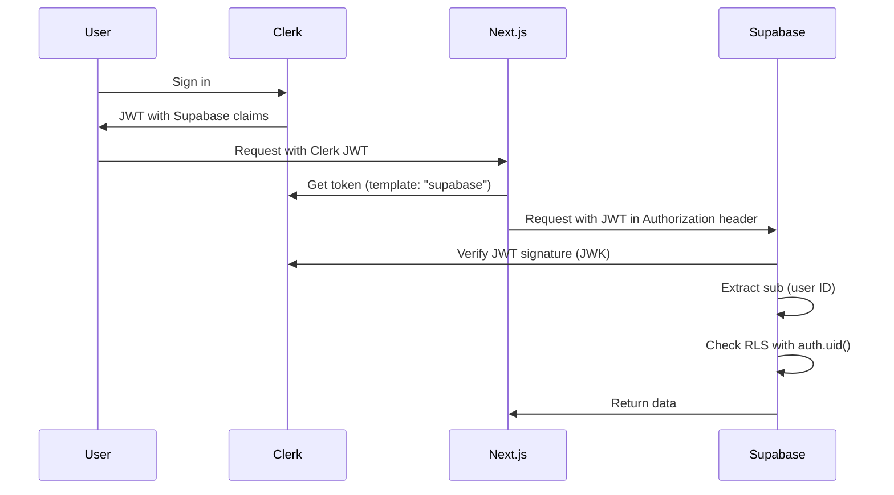

# Clerk + Supabase Setup Guide

SafaiSetu uses **Clerk** for authentication and **Supabase** for database + storage. This guide explains how to wire them together.

---

## Architecture

```
User → Clerk (Auth) → JWT with Supabase claims → Supabase (DB/Storage with RLS)
```

**Why this matters:** Supabase RLS policies check `auth.uid()`. With Clerk, we configure a JWT template so Supabase recognizes Clerk users as authenticated.

---

## Step 1: Set Up Clerk

### 1a. Create Clerk Application (Already Done)

Your Clerk instance is already created:
- **Instance:** `fluent-locust-4410.clerk.accounts.dev`
- **Dashboard:** [https://dashboard.clerk.com](https://dashboard.clerk.com)

### 1b. Collect Clerk API Keys

1. Go to [Clerk Dashboard](https://dashboard.clerk.com)
2. Select your application: **fluent-locust-4410**
3. Go to **API Keys** (left sidebar)
4. Copy these values:
   - **Publishable key** → `NEXT_PUBLIC_CLERK_PUBLISHABLE_KEY`
   - **Secret key** → `CLERK_SECRET_KEY`

**Example:**
```bash
NEXT_PUBLIC_CLERK_PUBLISHABLE_KEY=pk_test_Zmx1ZW50LWxvY3VzdC00NDEwLmNsZXJrLmFjY291bnRzLmRldiQ
CLERK_SECRET_KEY=sk_test_...
```

⚠️ **Keep `CLERK_SECRET_KEY` secret** — never commit it to git.

---

## Step 2: Configure Clerk JWT Template for Supabase

This is **critical** for RLS to work. Clerk must issue JWTs that Supabase accepts.

### 2a. Create JWT Template

1. In Clerk Dashboard, go to **JWT Templates** (left sidebar)
2. Click **"New template"**
3. Choose **"Supabase"** from the template list
4. Name: `supabase`
5. The template will pre-fill with these claims:

```json
{
  "aud": "authenticated",
  "exp": {{user.created_at}},
  "sub": "{{user.id}}",
  "email": "{{user.primary_email_address}}",
  "role": "authenticated",
  "user_metadata": {
    "full_name": "{{user.full_name}}",
    "avatar_url": "{{user.profile_image_url}}"
  }
}
```

6. Click **"Save"**

### 2b. Copy JWT Issuer URL

After creating the template, Clerk shows an **Issuer** URL. Copy it (looks like: `https://fluent-locust-4410.clerk.accounts.dev`).

You'll need this for Supabase configuration in the next step.

---

## Step 3: Configure Supabase to Accept Clerk JWTs

### 3a. Add Clerk as Third-Party Auth Provider

1. Go to [Supabase Dashboard](https://supabase.com/dashboard)
2. Select your project: **gtqrseqwlxcvygnezonu**
3. Go to **Authentication** → **Providers** (left sidebar)
4. Scroll to **"Third-party Auth Providers"** section
5. Click **"Add provider"**
6. Fill in:
   - **Name:** `Clerk` (or any name you prefer)
   - **Issuer:** `https://fluent-locust-4410.clerk.accounts.dev` (from Step 2b)
   - **JWT Verification Key (JWK URL):** `https://fluent-locust-4410.clerk.accounts.dev/.well-known/jwks.json`
7. Click **"Save"**

**What this does:** Supabase now trusts JWTs signed by Clerk. When a Clerk user makes a request, Supabase extracts `sub` (user ID) from the JWT and `auth.uid()` returns that value.

### 3b. Verify Configuration

Test that Supabase accepts Clerk tokens:

1. Start your app: `npm run dev`
2. Sign in with Clerk (http://localhost:3000/login)
3. Submit a cleanup (http://localhost:3000/submit)
4. Check Supabase Dashboard → Table Editor → `submissions` table
5. The `user_id` column should show your Clerk user ID (starts with `user_...`)

If RLS errors occur, double-check:
- JWT template name is exactly `supabase` (case-sensitive)
- Issuer URL matches your Clerk instance
- JWK URL is correct (append `/.well-known/jwks.json` to issuer)

---

## Step 4: Set Environment Variables

1. Copy `.env.example` to `.env.local`:
   ```bash
   cp .env.example .env.local
   ```

2. Fill in your values:
   ```bash
   # Clerk (from Step 1b)
   NEXT_PUBLIC_CLERK_PUBLISHABLE_KEY=pk_test_Zmx1ZW50LWxvY3VzdC00NDEwLmNsZXJrLmFjY291bnRzLmRldiQ
   CLERK_SECRET_KEY=sk_test_...

   # Supabase (database + storage only)
   NEXT_PUBLIC_SUPABASE_URL=https://gtqrseqwlxcvygnezonu.supabase.co
   NEXT_PUBLIC_SUPABASE_PUBLISHABLE_KEY=your-anon-key-here

   # Site URL
   NEXT_PUBLIC_SITE_URL=http://localhost:3000

   # Admin emails
   ADMIN_EMAILS=your-email@example.com
   ```

3. Restart dev server:
   ```bash
   npm run dev
   ```

---

## Step 5: Set Admin Permissions

Choose **one** method to grant admin access:

### Method A: Email Allowlist (easiest)

Already done if you set `ADMIN_EMAILS` in Step 4. Your email will have admin access.

### Method B: Public Metadata (more secure)

1. Sign in to SafaiSetu once (http://localhost:3000/login)
2. In Clerk Dashboard, go to **Users** (left sidebar)
3. Find your user → click to open
4. Scroll to **Public metadata** section
5. Click **"Edit"**
6. Add JSON:
   ```json
   {
     "role": "admin"
   }
   ```
7. Click **"Save"**

**Which to use?**
- Email allowlist: Quick for development, easy to add/remove admins
- Public metadata: Cleaner for production, role stored in Clerk

---

## Step 6: Test the Flow

### 6a. Sign In

1. Go to http://localhost:3000/login
2. Sign up or sign in (Clerk handles email/password, Google, etc.)
3. After sign-in, you should see your avatar in the nav bar

### 6b. Submit a Cleanup

1. Go to http://localhost:3000/submit
2. Upload a test photo
3. Drop a pin on the map
4. Choose category and status
5. Write a short story
6. Click **"Submit for review"**
7. Should see: "In the queue"

### 6c. View Your Submissions

1. Go to http://localhost:3000/me
2. Should see your submission with photo
3. Status: "pending"

### 6d. Moderate (Admin Only)

1. Go to http://localhost:3000/admin
2. Should see your submission
3. Click **"Approve"** or **"Feature"**
4. Check the map → pin should appear

### 6e. Verify Database

1. In Supabase Dashboard → Table Editor → `submissions`
2. Check `user_id` column → should have your Clerk user ID (e.g., `user_2abc...`)
3. If it's empty or RLS errors occur, JWT configuration needs fixing (go back to Step 3)

---

## How It Works

### Authentication Flow



### Key Points

1. **Clerk owns identity** — sign-in, sign-up, profile, sessions
2. **JWT bridges the gap** — Clerk issues JWTs that Supabase trusts
3. **Supabase RLS works** — `auth.uid()` returns Clerk user ID from JWT
4. **Storage paths use Clerk ID** — uploads go to `{clerk-user-id}/file.jpg`

---

## Troubleshooting

### "User not found" or RLS errors

**Symptom:** Submissions fail with "new row violates row-level security policy"

**Cause:** Supabase doesn't recognize Clerk JWT

**Fix:**
1. Check JWT template name is exactly `supabase` (case-sensitive)
2. Verify Clerk issuer is added to Supabase → Authentication → Providers
3. Restart dev server after changing JWT template

### "/admin returns 'Access denied'"

**Symptom:** Signed-in user can't access admin page

**Cause:** Email not in allowlist or publicMetadata missing

**Fix:**
1. Check `ADMIN_EMAILS` in `.env.local` matches your Clerk email exactly
2. OR set `publicMetadata.role = "admin"` in Clerk Dashboard → Users
3. Sign out and sign in again

### Photos don't show in admin queue

**Symptom:** Submissions appear but no media

**Cause:** Storage bucket policies or signed URL generation

**Fix:**
1. Check Supabase → Storage → `submissions` bucket exists and is private
2. Verify migration ran (Step 3 in SUPABASE_SETUP.md)
3. Check browser console for 403 errors

### "Cannot read properties of undefined (reading 'id')"

**Symptom:** App crashes on `/me` or `/submit`

**Cause:** User not signed in or Clerk not loaded

**Fix:**
1. Check Clerk keys in `.env.local`
2. Ensure ClerkProvider wraps app in `layout.tsx`
3. Use `useUser()` hook and check `isSignedIn` before accessing `user.id`

---

## Deploy to Production

### Vercel Deployment

1. Push code to GitHub
2. Import repo in [Vercel](https://vercel.com)
3. Add environment variables:
   - `NEXT_PUBLIC_CLERK_PUBLISHABLE_KEY`
   - `CLERK_SECRET_KEY`
   - `NEXT_PUBLIC_SUPABASE_URL`
   - `NEXT_PUBLIC_SUPABASE_PUBLISHABLE_KEY`
   - `NEXT_PUBLIC_SITE_URL` (production domain)
   - `ADMIN_EMAILS`
4. Deploy

### Update Clerk for Production

1. In Clerk Dashboard → **Domains**
2. Add production domain (e.g., `safaisetu.vercel.app`)
3. Update redirect URLs if needed

### Update Supabase for Production

No changes needed — JWT issuer stays the same for dev + production.

---

## What Changed from Supabase Auth

| Before (Supabase Auth) | After (Clerk) |
|------------------------|---------------|
| Google OAuth via Supabase | Clerk handles auth (email, Google, etc.) |
| `/auth/callback` route | Clerk manages callbacks |
| `supabase.auth.getClaims()` | `useUser()` hook from Clerk |
| `auth.uid()` from Supabase session | `auth.uid()` from Clerk JWT |
| Admin via `app_metadata.role` | Admin via `publicMetadata.role` |
| Session in Supabase cookies | Session in Clerk cookies |

**What stayed the same:**
- ✅ Supabase database (Postgres)
- ✅ Supabase storage (files)
- ✅ RLS policies (still work via JWT)
- ✅ Submit → moderate → publish flow

---

## Required Secrets Summary

| Secret | Where to Find | Purpose |
|--------|--------------|---------|
| `NEXT_PUBLIC_CLERK_PUBLISHABLE_KEY` | Clerk Dashboard → API Keys | Client-side auth |
| `CLERK_SECRET_KEY` | Clerk Dashboard → API Keys | Server-side auth |
| `NEXT_PUBLIC_SUPABASE_URL` | Supabase Dashboard → API | Database connection |
| `NEXT_PUBLIC_SUPABASE_PUBLISHABLE_KEY` | Supabase Dashboard → API | Database access (anon key) |

**NOT needed:**
- ❌ Google OAuth credentials (Clerk handles it)
- ❌ Supabase service role key (RLS via JWT is cleaner)

---

## Support

- Clerk docs: [clerk.com/docs](https://clerk.com/docs)
- Clerk + Supabase guide: [clerk.com/docs/integrations/databases/supabase](https://clerk.com/docs/integrations/databases/supabase)
- Supabase third-party auth: [supabase.com/docs/guides/auth/third-party-auth](https://supabase.com/docs/guides/auth/third-party-auth)
